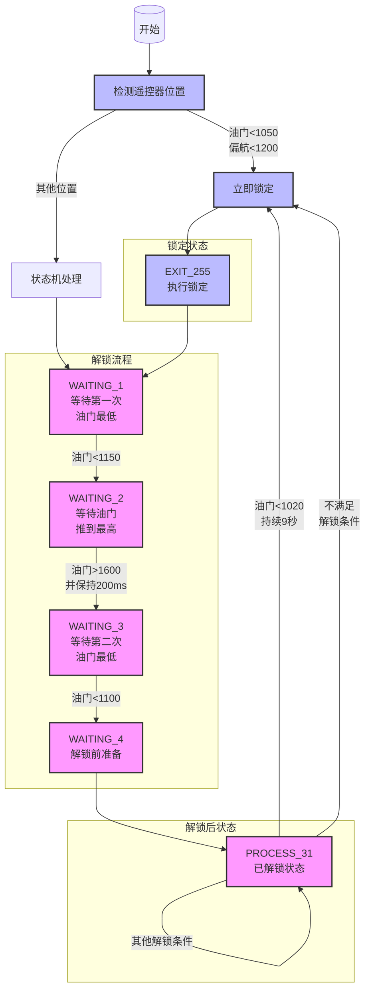

# 主控程序

## 一、主控程序工程结构分析


## 二、程序流程图-main.c


`ALL_DEFINE.h`

```h
#ifndef __ALL_DEFINE_H__
#define __ALL_DEFINE_H__
#include "ALL_DATA.h"
#include "ANO_DT.h"
#include "I2C.h"
#include "INIT.h"
#include "LED.h"
#include "Remote.h"
#include "SPI.h"
#include "TIM.h"
#include "USART.h"
#include "USB_HID.h"
#include "control.h"
#include "imu.h"
#include "mpu6050.h"
#include "myMath.h"
#include "nrf24l01.h"
#include "stm32f10x.h"
#include "sys.h"

#undef SUCCESS
#define SUCCESS 0
#undef FAILED
#define FAILED 1

#endif

```

- 硬件驱动相关：I2C.h, SPI.h, TIM.h, USART.h
- 外设相关：LED.h, Remote.h, USB_HID.h
- 传感器相关：imu.h, mpu6050.h
- 通信模块：nrf24l01.h
- 系统相关：stm32f10x.h, sys.h
- 功能模块：control.h, myMath.h

`ALL_DATA.h`

```h
#ifndef _ALL_USER_DATA_H_
#define _ALL_USER_DATA_H_

typedef signed char int8_t;
typedef signed short int int16_t;
typedef signed int int32_t;
typedef signed long long int64_t;

/* exact-width unsigned integer types */
typedef unsigned char uint8_t;
typedef unsigned short int uint16_t;
typedef unsigned int uint32_t;
typedef unsigned long long uint64_t;

//#define NULL 0
extern volatile uint32_t SysTick_count;

typedef struct {
    int16_t accX;   // 加速度计X轴
    int16_t accY;   // 加速度计Y轴
    int16_t accZ;   // 加速度计Z轴
    int16_t gyroX;  // 陀螺仪X轴
    int16_t gyroY;  // 陀螺仪Y轴
    int16_t gyroZ;  // 陀螺仪Z轴
} _st_Mpu;

typedef struct {
    float roll;   // 横滚角
    float pitch;  // 俯仰角
    float yaw;    // 偏航角
} _st_AngE;

typedef struct {
    uint16_t roll;   // 横滚通道
    uint16_t pitch;  // 俯仰通道
    uint16_t thr;    // 油门通道
    uint16_t yaw;    // 偏航通道
    uint16_t AUX1;   // 辅助通道1
    uint16_t AUX2;   // 辅助通道2
    uint16_t AUX3;   // 辅助通道3
    uint16_t AUX4;   // 辅助通道4
} _st_Remote;

typedef volatile struct {
    float desired;         // 期望值
    float offset;          // 偏移量
    float prevError;       // 上次误差
    float integ;           // 积分项
    float kp;              // 比例系数
    float ki;              // 积分系数
    float kd;              // 微分系数
    float IntegLimitHigh;  // 积分上限
    float IntegLimitLow;   // 积分下限
    float measured;        // 测量值
    float out;             // 输出值
    float OutLimitHigh;    // 输出上限
    float OutLimitLow;     // 输出下限
} PidObject;

typedef volatile struct {
    uint8_t unlock;
} _st_ALL_flag;

extern _st_Remote Remote;
extern _st_Mpu MPU6050;
extern _st_AngE Angle;

extern _st_ALL_flag ALL_flag;

extern PidObject pidRateX;
extern PidObject pidRateY;
extern PidObject pidRateZ;

extern PidObject pidPitch;
extern PidObject pidRoll;
extern PidObject pidYaw;

extern int16_t motor_PWM_Value[4];

#endif

```

关于`volatile`关键字，详情请看[C/C++ 中 volatile 关键字详解](https://www.runoob.com/w3cnote/c-volatile-keyword.html)

`main.c`

```c
/*******************************************************************
 *程序入口
 *@brief 主初始化函数。轮询调用的函数
 *@brief 
 *@time  2021.1.8
 *@editor zin小店
 *飞控爱好QQ群551883670,邮箱759421287@qq.com
 *非授权使用人员，禁止使用。禁止传阅，违者一经发现，侵权处理。
 ******************************************************************/
#include "ALL_DEFINE.h"

//特别声明：请在无人空旷的地带或者室内进行飞行。遇到非常紧急的情况，可紧急关闭遥控。

//           机头
//   PWM3     ♂       PWM1
//      *           *
//      	*       *
//    		  *   *
//      			*
//    		  *   *
//      	*       *
//      *           *
//    PWM4           PWM2
int main(void) {
    cycleCounterInit();                              //得到系统每个us的系统CLK个数，为以后延时函数，和得到精准的当前执行时间使用
    NVIC_PriorityGroupConfig(NVIC_PriorityGroup_2);  //2个bit的抢占优先级，2个bit的子优先级
    SysTick_Config(SystemCoreClock / 1000);          //系统滴答时钟

    ALL_Init();  //系统初始化
    /*
		while循环里做一些比较不重要的事情，比如上位机和LED控制。
		其余功能皆安排在中断，整个工程只有一个3ms更新一次的中断，请见scheduler.c里面的工作
	*/
    while (1) {
        ANTO_polling();  //匿名上位机发送数据
        // Usb_Hid_Receive();  //USB接收到匿名上位机的数据
        PilotLED();  //LED刷新
    }
}

```

`ALL_Init()`在`INIT.c`中

```c
void ALL_Init(void) {
  USB_HID_Init();  //USB上位机初始化

  IIC_Init();  //I2C初始化

  pid_param_Init();  //PID参数初始化

  delay_ms(200);
  MpuInit();        //MPU6050初始化
	// ----------------------------------------
	// 水平静止标定，该功能只需要进行一次，不要每次进行。店家发货前已经进行一次标定了，标定完后会自动保存到MCU的FLASH中。
	// 如需校准，重新打开即可，延时5S是为了插上电池后有充足的时间将飞行器放在地上进行水平静止标定。
	// delay_ms(5000);MpuGetOffset();
	// ---------------------------------------- 
  // USART1_Config();  //备用串口

  NRF24L01_init();  //2.4G遥控通信初始化

  TIM2_PWM_Config();  //4路PWM初始化
  TIM3_PWM_Config();  //LED PWM初始化

  TIM1_Config();  //系统工作周期初始化
}
```

`USB_HID_Init()`用于HID设备初始化，主要用于飞行器与PC之间的数据交互

`TIM2_PWM_Config()`PA0~3，为电机PWM，`PSC=9-1，ARR=1000-1`，PWM频率8KHz

`TIM3_PWM_Config()`PA6/7, PB0/1，LED PWM，`PSC=36-1，ARR=1000-1`，PWM频率2KHz

`TIM1_Config()`TIM1定时器设置3ms一次中断，在回调函数中执行核心控制程序`PSC=720-1，ARR=300-1`

## 三、核心控制程序-schedualer.c

```c
void TIM1_UP_IRQHandler(void)  //TIM1中断 3ms
{
  if (TIM_GetITStatus(TIM1, TIM_IT_Update) != RESET)  //检查指定的TIM中断发生与否:TIM 中断源
  {
    MpuGetData();
    GetAngle(&MPU6050, &Angle, 0.003f);
    RC_Analy();
    FlightPidControl(0.003f);
    MotorControl();

    TIM_ClearITPendingBit(TIM1, TIM_IT_Update);  //清除TIMx的中断待处理位:TIM 中断源
  }
}

```

`MpuGetData()`获取MPU6050加速度，角速度以

```c
#define Acc_Read()  IIC_read_Bytes(MPU6050_ADDRESS, 0X3B, buffer, 6)
#define Gyro_Read() IIC_read_Bytes(MPU6050_ADDRESS, 0x43, &buffer[6], 6)

void MpuGetData(void)  //读取陀螺仪数据加滤波
{
  uint8_t i;
  uint8_t buffer[12];

  Acc_Read();   //去读加速度
  Gyro_Read();  //读取角速度

  for (i = 0; i < 6; i++) {
    pMpu[i] = (((int16_t)buffer[i << 1] << 8) | buffer[(i << 1) + 1]) - MpuOffset[i];  //整合为16bit，并减去水平静止校准值
    if (i < 3)                                                                         //以下对加速度做卡尔曼滤波
    {
      {
        static struct _1_ekf_filter ekf[3] = {{0.02, 0, 0, 0, 0.001, 0.543}, {0.02, 0, 0, 0, 0.001, 0.543}, {0.02, 0, 0, 0, 0.001, 0.543}};
        kalman_1(&ekf[i], (float)pMpu[i]);  //一维卡尔曼
        pMpu[i] = (int16_t)ekf[i].out;
      }
    }
    if (i > 2)  //以下对角速度做一阶低通滤波
    {
      uint8_t k = i - 3;
      const float factor = 0.15f;  //滤波因素
      static float tBuff[3];

      pMpu[i] = tBuff[k] = tBuff[k] * (1 - factor) + pMpu[i] * factor;
    }
  }
}
```

根据MPU6050数据手册，加速度在寄存器地址以`0X3B`开始的连续6个地址中，角速度在`0x43`开始的连续6个中


分别两个地址存高八位以及低八位

`pMpu[i] = (((int16_t)buffer[i << 1] << 8) | buffer[(i << 1) + 1]) - MpuOffset[i]`，`(((int16_t)buffer[i << 1] << 8) | buffer[(i << 1) + 1])`将高八位与第八位的值相加得到具体值，并减去姿态校正。

`GetAngle(&MPU6050, &Angle, 0.003f)`通过四元组等算法获取MPU6050姿态数据。

`RC_Analy()`遥控数据解析通信

```c
void RC_Analy(void) {
  static uint16_t cnt;
  /*             Receive  and check RC data                               */
  if (NRF24L01_RxPacket(RC_rxData) == SUCCESS) {
    uint8_t i;
    uint8_t CheckSum = 0;

    cnt = 0;

    for (i = 0; i < 31; i++) {
      CheckSum += RC_rxData[i];
    }
    if (RC_rxData[31] == CheckSum && RC_rxData[0] == 0xAA && RC_rxData[1] == 0xAF)  //如果接收到的遥控数据正确
    {
      Remote.roll = ((uint16_t)RC_rxData[4] << 8) | RC_rxData[5];  //通道1
      Remote.roll = LIMIT(Remote.roll, 1000, 2000);
      Remote.pitch = ((uint16_t)RC_rxData[6] << 8) | RC_rxData[7];  //通道2
      Remote.pitch = LIMIT(Remote.pitch, 1000, 2000);
      Remote.thr = ((uint16_t)RC_rxData[8] << 8) | RC_rxData[9];  //通道3
      Remote.thr = LIMIT(Remote.thr, 1000, 2000);
      Remote.yaw = ((uint16_t)RC_rxData[10] << 8) | RC_rxData[11];  //通道4
      Remote.yaw = LIMIT(Remote.yaw, 1000, 2000);
      Remote.AUX1 = ((uint16_t)RC_rxData[12] << 8) | RC_rxData[13];  //通道5  左上角按键都属于通道5
      Remote.AUX1 = LIMIT(Remote.AUX1, 1000, 2000);
      Remote.AUX2 = ((uint16_t)RC_rxData[14] << 8) | RC_rxData[15];  //通道6  右上角按键都属于通道6
      Remote.AUX2 = LIMIT(Remote.AUX2, 1000, 2000);
      Remote.AUX3 = ((uint16_t)RC_rxData[16] << 8) | RC_rxData[17];  //通道7  左下边按键都属于通道7
      Remote.AUX3 = LIMIT(Remote.AUX3, 1000, 2000);
      Remote.AUX4 = ((uint16_t)RC_rxData[18] << 8) | RC_rxData[19];  //通道8  右下边按键都属于通道6
      Remote.AUX4 = LIMIT(Remote.AUX4, 1000, 4000);

      {
		/* 控控制姿态的量+-500*0.04=+-20° */
        const float roll_pitch_ratio = 0.04f;
        const float yaw_ratio = 0.3f;

		/* 将遥杆值作为飞行角度的期望值，航模数据是 1000~2000，所以以 1500 为中心 */
        pidPitch.desired = -(Remote.pitch - 1500) * roll_pitch_ratio;  //将遥杆值作为飞行角度的期望值
        pidRoll.desired = -(Remote.roll - 1500) * roll_pitch_ratio;

        /* 左右转，增量式，慢慢改变目标值 */
        if (Remote.yaw > 1820) {
          pidYaw.desired -= yaw_ratio;
        } else if (Remote.yaw < 1180) {
          pidYaw.desired += yaw_ratio;
        }
      }
      remote_unlock();
    }
  }
  //如果3秒没收到遥控数据，则判断遥控信号丢失，飞控在任何时候停止飞行，避免伤人。
  //意外情况，使用者可紧急关闭遥控电源，飞行器会在3秒后立即关闭，避免伤人。
  //立即关闭遥控，如果在飞行中会直接掉落，可能会损坏飞行器。
  else {
    cnt++;
    if (cnt > 500) {
      cnt = 0;
      ALL_flag.unlock = 0;
      NRF24L01_init();
    }
  }
}
```

根据已定的遥控通信协议对收到的数据进行解析。


解锁函数`remote_unlock`

```c
void remote_unlock(void) {
  volatile static uint8_t status = WAITING_1;
  static uint16_t cnt = 0;

  if (Remote.thr < 1050 && Remote.yaw < 1200)  //油门遥杆左下角锁定
  {
    status = EXIT_255;
  }

  switch (status) {
    case WAITING_1:           //等待解锁
      if (Remote.thr < 1150)  //解锁三步奏，油门最低->油门最高->油门最低 看到LED灯不闪了 即完成解锁
      {
        status = WAITING_2;
      }
      break;
    case WAITING_2:
      if (Remote.thr > 1600) {
        static uint8_t cnt = 0;
        cnt++;
        if (cnt > 5)  //最高油门需保持200ms以上，防止遥控开机初始化未完成的错误数据
        {
          cnt = 0;
          status = WAITING_3;
        }
      }
      break;
    case WAITING_3:
      if (Remote.thr < 1100) {
        status = WAITING_4;
      }
      break;
    case WAITING_4:  //解锁前准备
      ALL_flag.unlock = 1;
      status = PROCESS_31;
      LED.status = AlwaysOn;
      imu_rest();
      break;
    case PROCESS_31:  //进入解锁状态
      if (Remote.thr < 1020) {
        if (cnt++ > 3000)  // 油门遥杆处于最低9S自动上锁
        {
          status = EXIT_255;
        }
      } else if (!ALL_flag.unlock)  //Other conditions lock
      {
        status = EXIT_255;
      } else
        cnt = 0;
      break;
    case EXIT_255:                 //进入锁定
      LED.status = AllFlashLight;  //exit
      cnt = 0;
      LED.FlashTime = 100;  //100*3ms
      ALL_flag.unlock = 0;
      status = WAITING_1;
      break;
    default:
      status = EXIT_255;
      break;
  }
}

```

状态如下



解锁流程：

- 第一步：油门推到最低（<1150）
- 第二步：油门推到最高（>1600）并保持200ms以上
- 第三步：油门再次推到最低（<1100）
- 完成以上步骤后设备解锁

安全特性：

- 油门最低保持9秒自动上锁
- 遥控器左下角（油门<1050且偏航<1200）可立即锁定
- 防止遥控器初始化未完成时的错误数据触发解锁
